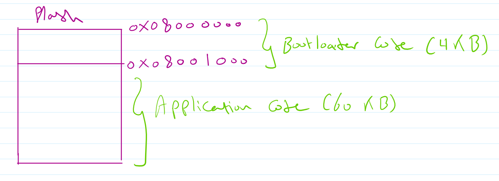

# Bootloader

A custom bootloader for STM32F103 based on ARM cortex M3. The bootloader uses UART1 to receive the code from USB TTL and flash the code using FPEC. The bootloader can check for checksum errors.

# Memory organization

The Bootloader takes 4 KB starting from 0x 0800 0000 to 0x 0800 1000. The application takes the rest of the flash memory. 

Therefore be aware that you need to edit your linker script based on these constraints 

# How it works
1- The python script waits for READY string from the microcontroller when entering the Bootloader 

2- The python script starts to send the intel HEX format line by line and displaying the record with its type to the user

3- The bootloader receives the record, checking the record type and execute the coresponding actions

    a- The first time the microcontroller enters the Bootloader, it erase the Application area

    b- If the record type is 00 (Data record), the bootloader will check the checksum ensuring no error in the record

    c- If no error in the record the microcontroller will use FPEC to write the record half-word by half-word

    d- After complete record written to the flash, the microcontroller sends "ok" string to the python script indecating the need for the next record

4- The python script continue the HEX file till the last record 

5- The microcontroller will end bootloader if the record type is 01 (EOF) or timeout due to systick (15 seconds)

# The python script
Python script takes the HEX file as input before running, After that it will send record by record to the microcontroller waiting for its "ok" string.

The script has two modes:

1- Sending "BOOT" string to the microcontroller indicating a soft reset (To enter the bootloader)

2- Just waiting for the "READY" string from the microcontroller

# Hardware used
1- STM32F103 (BluePill)

2- ST-LINK V2: To flash the bootloader

3- USB TTL: To connect the microcontroller to PC

4- LEDs: For indication

